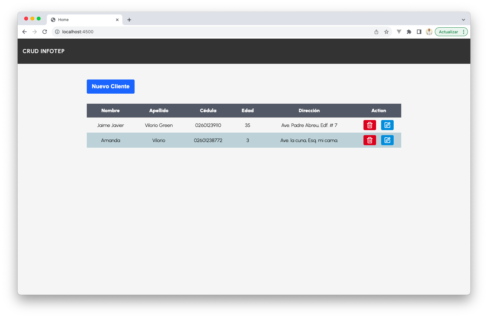

# CRUD INFOTEP
Tarea asignada como parte del módulo de Node.js en el Técnico Profesional en Diseño y Creación de Software de Infotep.

## Requerimientos
- Node.js 18+
- [Pnpm](https://pnpm.io/es/) como gestor de paquete de Node
- MySQL 8

## Observaciones
Debe crear la base de datos correspondiente con la tabla [clientes](./src/database/queries.sql).